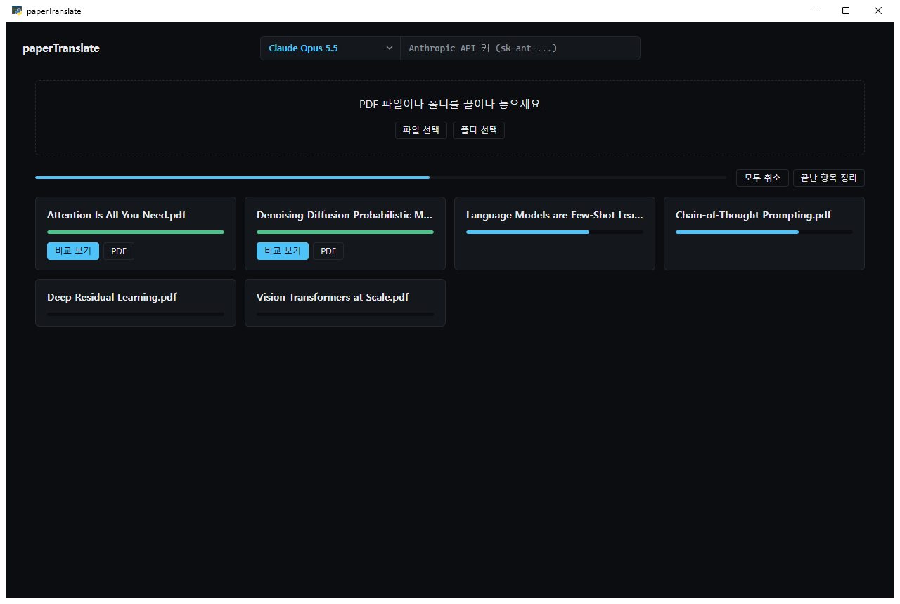

<div align="center">

# paperTranslate

영어 논문 PDF를 원문 레이아웃 그대로 한국어로 번역하는 Windows 데스크톱 앱

[](https://github.com/Erzyh/paperTranslate/releases/latest)
[](https://github.com/Erzyh/paperTranslate/releases)
[](LICENSE)
[](#설치와-실행)
<br>
[](backend/requirements.txt)
[](backend)
[](frontend)
[](frontend)
[](https://ollama.com)



</div>

2단 칼럼, 그림, 표, 수식, 페이지 배치는 그대로 두고 본문 텍스트만 한국어로 바꾼 PDF를 만듭니다.
원문과 번역을 나란히 놓고 읽을 수 있고, 논문 여러 편이나 폴더 하나를 통째로 넣어 한 번에 번역할 수 있습니다.

## 주요 기능

- 원문 레이아웃을 유지한 번역 PDF
- 레이아웃 인식 모델로 제목, 본문, 그림, 표, 수식, 머리말/꼬리말을 구분합니다. Nature나 Science처럼 표지와 인포그래픽이 화려한 레이아웃도 본문만 골라 번역합니다.
- 글자 레이어가 없는 스캔 PDF는 OCR로 읽어서 번역합니다.
- 원문과 번역을 나란히 보는 화면 (문단 연결, 그림과 표 미리보기, 인용 번호를 누르면 참고문헌 정보)
- 선택한 문장이나 수식을 AI가 풀어서 설명
- 여러 편을 한 번에 번역. 폴더를 넣으면 하위 폴더까지 PDF를 찾아서 순서대로 번역합니다.
- 모델 선택: OpenAI, Google Gemini, Anthropic Claude API 또는 내 PC의 로컬 모델(Ollama)
- 수식, 인용 번호, URL, 이메일, DOI, 인명, 모델과 데이터셋 이름, 약어(GPT-4, ImageNet, LLM 등)는 번역하지 않고 원문 그대로 둡니다.

## 설치와 실행

1. [Releases](https://github.com/Erzyh/paperTranslate/releases/latest)에서 `paperTranslate-Setup-*.exe`를 받아 실행합니다.
2. 설치가 끝나면 시작 메뉴(원하면 바탕화면)의 paperTranslate로 실행합니다.

관리자 권한 없이 사용자 계정에만 설치됩니다 (`%LOCALAPPDATA%\Programs\paperTranslate`). 지울 때는 "설정 > 앱"에서 paperTranslate를 제거하면 되고, 이때 번역 기록과 설정도 지울지 묻습니다.

설치 파일을 실행할 때 "Windows의 PC 보호" 창이 뜨면 "추가 정보"를 누른 뒤 "실행"을 누르세요. 코드 서명을 하지 않은 프로그램이라 나오는 안내입니다.
화면은 Windows 10/11에 들어 있는 WebView2로 띄우므로 따로 설치할 것은 없습니다.
앱 창을 닫으면 번역 서버도 같이 꺼지고, 번역 중인 논문이 있으면 닫기 전에 한 번 묻습니다.

## 번역 모델

화면 맨 위 가운데의 드롭다운에서 고릅니다.

| 구분 | 모델 | 필요한 것 |
|---|---|---|
| OpenAI | GPT-6 LUNA, GPT-5.6 LUNA, GPT-6 SOL, GPT-5.6 TERRA, GPT-6 ASTRA | OpenAI API 키 (`sk-...`) |
| Google | Gemini 3.8 Flash | Gemini API 키 |
| Anthropic | Claude Opus 5.5 | Anthropic API 키 (`sk-ant-...`) |
| 로컬 | 내 PC의 Ollama에 설치된 모델 (예: `qwen3.5:9b`) | [Ollama](https://ollama.com) 설치 후 `ollama pull qwen3.5:9b` |

API 키는 제공사마다 따로 이 PC의 앱 안에만 저장됩니다. 번역 서버는 키를 파일, DB, 로그 어디에도 남기지 않습니다. 공용 PC에서는 다 쓰고 나서 입력칸의 "지우기"를 눌러 주세요.

로컬 모델을 쓰면 논문이 PC 밖으로 나가지 않습니다. VRAM 8GB라면 `qwen3.5:9b`를 추천합니다. 이름이 `-cloud`로 끝나는 Ollama 클라우드 모델은 논문이 외부 서버로 가기 때문에 목록에 넣지 않았습니다.

Claude는 안전 분류기 때문에 일부 문단(예: 생물학 이중 용도 연구)의 번역을 거절할 수 있습니다. 그러면 Anthropic 서버의 대체 모델로 다시 시도하고, 그래도 안 되면 그 문단만 원문으로 두고 나머지를 계속 번역합니다.

## 자동 업데이트

앱을 켜면 이 저장소의 최신 릴리즈를 확인하고, 새 버전이 있으면 업데이트할지 묻습니다.

"업데이트"를 누르면 앱을 쓰는 동안 뒤에서 내려받고, 릴리즈에 함께 올라간 체크섬(`.sha256`)으로 파일을 검증합니다. 다 받은 뒤 앱을 닫으면 새 버전으로 바뀝니다. 바로 바꾸려면 오른쪽 아래의 "지금 재시작"을 누르면 됩니다.

"이 버전 건너뛰기"를 누르면 그 버전은 다시 묻지 않고, 그다음 버전이 나오면 다시 알려 줍니다.

설치 파일 대신 zip을 받아 쓰는 경우에도 자동 업데이트가 됩니다. 이때는 `Program Files`가 아니라 문서나 바탕화면처럼 쓰기 권한이 있는 폴더에 압축을 풀어 두세요.

## 데이터 위치

업로드한 PDF, 번역 결과, 기록은 `%LOCALAPPDATA%\paperTranslate`에 저장됩니다. 앱을 제거할 때 이 폴더도 지울지 묻고, zip으로 쓰다가 지운 경우에는 직접 지워 주세요.

## 환경변수 설정

모두 선택 사항입니다.

| 환경변수 | 기본값 | 설명 |
|---|---|---|
| `PAPERTRANSLATE_MAX_PARALLEL_OLLAMA` | `2` | 로컬 모델로 동시에 번역하는 편수. GPU에 여유가 있으면 올려도 됩니다. |
| `PAPERTRANSLATE_MAX_PARALLEL_OPENAI`, `_GEMINI`, `_ANTHROPIC` | `4` | API 모델로 동시에 번역하는 편수 |
| `PAPERTRANSLATE_CLAUDE_EFFORT` | `medium` | Claude 사고 깊이 (`low`, `medium`, `high`, `xhigh`, `max`) |
| `PAPERTRANSLATE_OLLAMA_MODEL` | 설치된 Qwen 중 자동 선택 | 로컬 기본 모델 |
| `PAPERTRANSLATE_OLLAMA_URL` | `http://localhost:11434` | Ollama 주소 |
| `PAPERTRANSLATE_OPENAI_BASE_URL` | `https://api.openai.com` | OpenAI 호환 서버를 쓸 때의 주소 |
| `PAPERTRANSLATE_S2_API_KEY` | 없음 | Semantic Scholar API 키. 없으면 참고문헌 조회가 요청 한도에 자주 걸릴 수 있습니다. |
| `PAPERTRANSLATE_FONT_PATH`, `_FONT_BOLD_PATH` | 자동 탐지 | 번역 본문과 제목 폰트(TTF) 경로. 기본은 함초롬바탕, 없으면 Noto Serif KR |

## 소스에서 실행하고 빌드하기

Windows, Python 3.13, Node.js가 필요합니다.

```powershell
# 백엔드 가상환경
cd backend
python -m venv .venv
.venv\Scripts\python.exe -m pip install -r requirements.txt -r ..\desktop\requirements.txt

# 레이아웃 인식 / OCR 모델 받기 (backend\models, 약 90MB)
.venv\Scripts\python.exe scripts\fetch_models.py

# 화면 빌드
cd ..\frontend
npm ci
npm run build

# 소스 상태로 앱 실행
cd ..
backend\.venv\Scripts\python.exe desktop\launcher.py
```

배포용 exe는 아래 명령으로 만듭니다. 결과물은 `dist\paperTranslate\paperTranslate.exe`입니다.

```powershell
powershell -ExecutionPolicy Bypass -File desktop\build.ps1
```

릴리즈에 올릴 설치 파일, zip, 체크섬은 `desktop\package.ps1`로 만듭니다. 설치 파일을 만들려면 [Inno Setup 6](https://jrsoftware.org/isinfo.php)이 필요합니다 (`winget install JRSoftware.InnoSetup`).

화면만 고칠 때는 백엔드를 `backend\.venv\Scripts\python.exe -m uvicorn app.main:app --port 8000`으로 띄우고(`PAPERTRANSLATE_TRANSLATOR`는 `ollama` 또는 `stub`), `frontend`에서 `npm run dev`를 실행한 뒤 http://localhost:5173 을 열면 됩니다.

### 테스트

```powershell
cd backend
.venv\Scripts\python.exe -m pytest -q
```

테스트는 가짜 번역기와 가짜 HTTP 응답으로만 돌아가고, Ollama, OpenAI, Gemini, Anthropic에 실제로 접속하지 않습니다.
모델 파일이 없으면 모델이 필요한 테스트는 건너뛰고, 앱은 규칙 기반 분석만으로 동작합니다 (`PAPERTRANSLATE_LAYOUT_MODEL=0`으로 일부러 끌 수도 있습니다).

## 폴더 구조

| 폴더 | 내용 |
|---|---|
| `backend/` | FastAPI 서버와 번역 파이프라인 (PDF 분석, 문단 분할, 번역, 재조판) |
| `frontend/` | React와 TypeScript로 만든 화면 |
| `desktop/` | 데스크톱 앱 실행기(pywebview)와 빌드, 패키징 스크립트 |

## 라이선스

[GNU Affero General Public License v3.0](LICENSE) (AGPL-3.0)

PDF 처리에 AGPL-3.0 라이선스인 [PyMuPDF](https://github.com/pymupdf/PyMuPDF)를 쓰기 때문에 이 프로젝트와 배포하는 앱 전체가 AGPL-3.0을 따릅니다.
누구나 쓰고 고칠 수 있지만, 고친 버전을 배포하거나 네트워크 서비스로 제공할 때는 그 소스 코드도 같은 라이선스로 공개해야 합니다.

레이아웃 인식(PP-DocLayoutV2)과 OCR(PP-OCRv6) 모델은 PaddlePaddle의 Apache-2.0 모델을 [RapidAI](https://github.com/RapidAI)가 ONNX로 변환한 것입니다. `backend/scripts/fetch_models.py`가 받아서 레이아웃 모델을 int8로 줄입니다.
